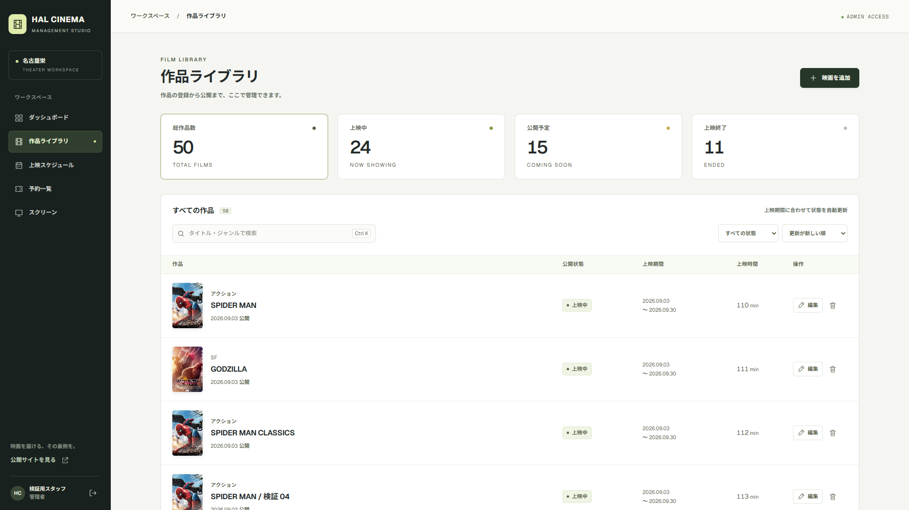

# 実装・検証レポート

確認日: 2026-09-10。実データとは別のPostgreSQLデータベースで検証しました。

| 項目 | 実装・確認内容 |
| --- | --- |
| 1. 機能 | 管理者認証、映画CRUD、検索・フィルタ・並び替え・ページ送り、自動ステータス、画像3方式、YouTube、上映登録、予約・設備の参照 |
| 2. UI/UX | サイドバー、ポスター中心の一覧、4つの情報グループとライブプレビュー、保存バー、トースト、ローディング、空表示、エラー再試行 |
| 3. 設計判断 | moviesを管理・一般画面の共通データ源とし、管理権限は毎回サーバーで検証。競合更新と予約履歴を保護 |
| 4. 主要ファイル | frontend/app/admin、frontend/app/api/cinema、frontend/lib/cinema-*、backend/admin_auth.py、movie_routes.py、movie_repository.py、schedule_routes.py、manage.py |
| 5. DB | users.role、moviesの上映開始・終了・予告URL、管理セッション、ログイン試行記録、適用済みマイグレーション管理を追加。既存の1作品・5上映回・9注文を維持 |
| 6. API | 管理者セッション、映画CRUD、画像アップロード、上映登録・削除を追加。公開作品・上映回と既存予約APIを連携。注文番号・購入時金額・作品名・上映日・座席ラベルをDBから返す |
| 7. 画像 | backend/uploadsへUUID名のWebP。DBはパスのみ。JPEG / PNG / WebP、5MB、20MP、最大辺2400px。内容とMIMEを検証 |
| 8. 自動テスト | フロント72件、バックエンド29件（実DB管理API14件、既存予約API15件）。境界日、入力、URL、認証、CSRF、失効、CRUD、競合、画像、座席重複と予約保護 |
| 9. ブラウザ操作 | 新規登録、編集、画像差し替え、公開反映、削除、上映登録、日時選択、座席A-1・一般1枚・フード980円の購入、管理側の合計2780円を確認 |
| 10. チェック | lint、tsc --noEmit、Nodeテスト、Pythonテスト、通常のnpm run buildを実行。ビルド版でもログイン制御と表示を確認 |
| 11. UI修正 | 薄い文字のコントラスト、デスクトップに出ていたメニューボタン、ブランド文字の折り返し、画像読込失敗、ダイアログの初期フォーカス、未保存移動の確認、狭い画面の編集ボタンの折り返しを修正 |
| 12. 制約 | 初回パスワードはローカル設定が必要。既存作品の未登録日時は運営者が入力。決済サービス本接続・メール送信・一般会員認証方式の全面改修は対象外。設備・予約は参照画面、日跨ぎ上映は未対応 |

## 画面確認

1920px、1366px、768px、390pxで表示を確認。下は専用DBの50作品を使った一覧です。検証データは実運用DBには入れていません。

検索と上映状態フィルタでGODZILLAの公開予定5件に絞り込み、ページ送りで50作品中13〜24件・2/5ページの表示を確認しました。狭い画面でメニューを開くとナビゲーションへフォーカスが移り、Escapeで閉じてメニューボタンに戻ることも確認しました。フォームと一覧のaxe検査では、修正後の違反は0件でした。これは当該画面の自動検査結果で、アプリ全体の適合保証ではありません。

画像は実ファイル選択、実際のPNGクリップボードとCtrl+V、Fileを渡したDropイベントで確認しました。権限付与はユーザー承認後に行い、検証後に解除してブラウザを閉じました。画像変更・削除、SVG、不正データ、5MB超過、必須項目未入力、日付逆転、不正YouTube URLも確認済みです。

通信失敗と0件の画面は専用ブラウザのAPI応答を切り替えて確認し、再試行で50作品の一覧へ戻ることを確認しました。DBが0件になるCRUDテストも別途実行しています。

## 保守・起動

[起動と初回管理者設定](ADMIN_SETUP.md)、[設計方針](ADMIN_DESIGN.md)を参照してください。通常起動は http://localhost:3001/admin/login です。管理者アカウントは admin@halcinema.example / HAL CINEMA管理者 を準備済みです。

検証用のビルド出力が通常の型・CSS生成に干渉したため、キャッシュを再生成し、[Tailwind公式のソース範囲指定](https://tailwindcss.com/docs/detecting-classes-in-source-files#setting-your-base-path)でappとlibだけを走査するようにしました。Dockerの生成キャッシュも専用ボリュームへ分離し、WindowsとDockerの同時書き込みを防ぎました。検証用のNext.js設定は残していません。

## 2026-09-12 管理者パスワード設定の修正

既存DBのusersにはupdated_at列がなく、パスワード設定時にUndefinedColumnが発生しました。前回のテストDBは最新のDDLから作っていたため、この差を検証できていませんでした。

移行SQLで不足している列を追加し、Set-AdminPassword.ps1もDB移行が成功してからパスワード入力へ進むよう修正しました。実DBへ適用済みです。適用前後で既存アカウントとパスワードハッシュが変わっていないこと、2ユーザー・1作品・5上映回・9注文が維持されていることを確認しました。

test_admin_setup.pyに3件の回帰テストを追加しました。専用PostgreSQLで古いusersテーブルを再現し、修正前の同じエラーと、修正後の移行・新規管理者作成・既存管理者のパスワード再設定・ログインAPI・旧セッション失効を確認しています。3件とも成功しました。実際のmanage.pyコマンドを別プロセスで実行し、テスト用パスワードが出力されないことも確認しました。
